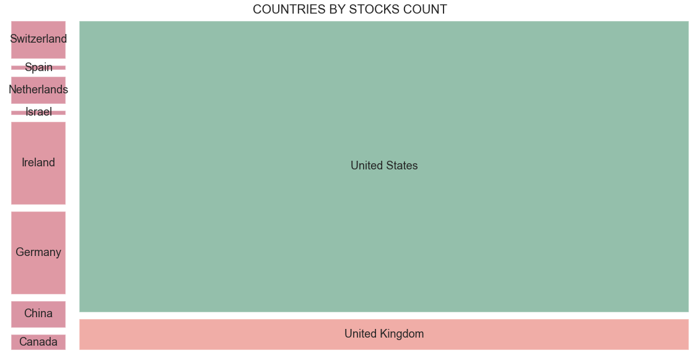
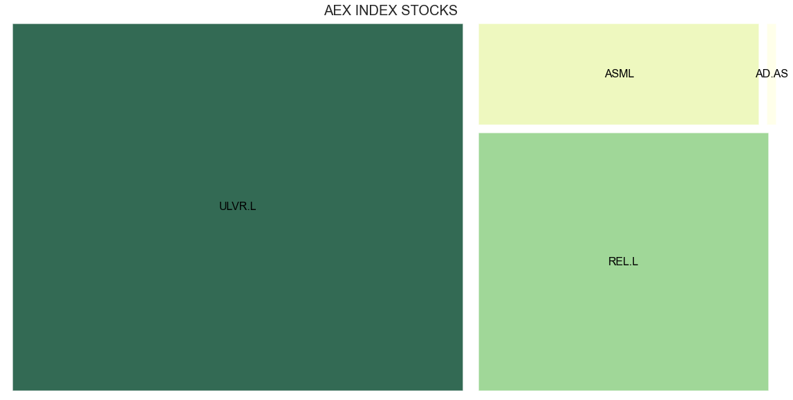
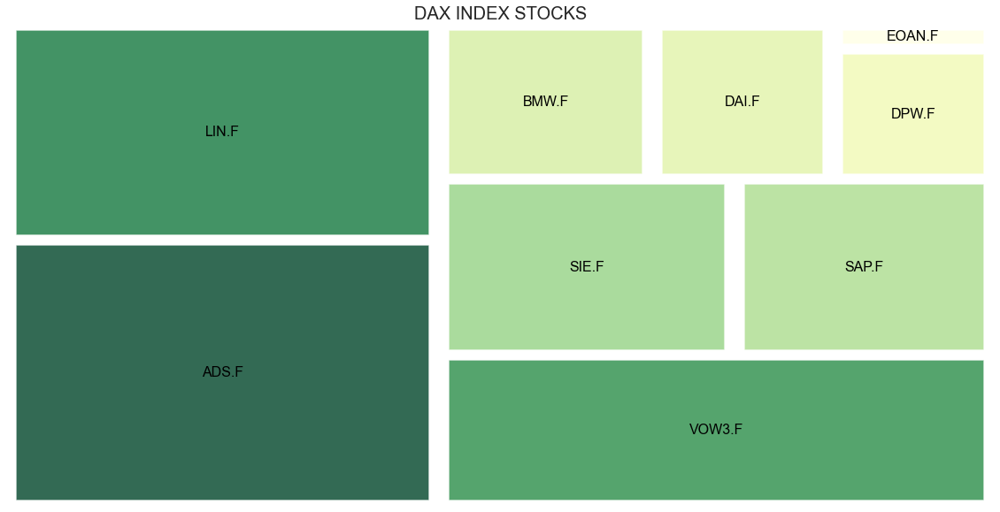
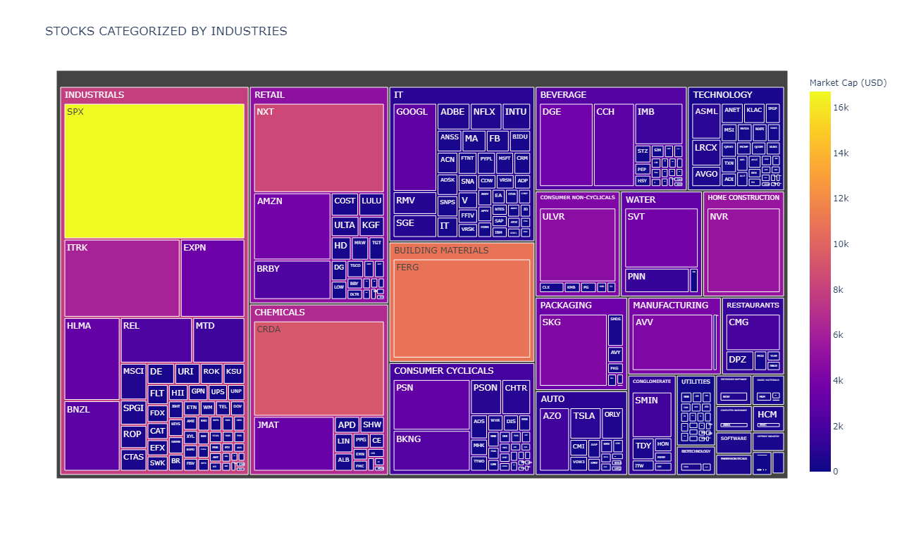

# Just another market stock treemap

There are many approaches for market stock classification or grouping. The present algorithm is only intended to share a basic example using a data source available through another repository. [View repository][1]

## Investment disclaimer

This project is distributed for general informational and educational purposes only and is not intended to constitute investment advice.

## Prerequisites

* Python (>= 3.8.5)
* squarify (>= 0.4.3)
* plotly (>= 4.14.3)
* plotly-orca (>= 1.3.1)

## Results

### According to the share count. 

### According to the market share capitalization ([squarify](2))

### According to the market share capitalization ([plotly](3))

## References

1. Moisés Alexander Salazar Vila. (n.d.). _Just another market stock value scoring algorithm_. GitHub. Retrieved on july 17, 2021 from https://github.com/malexandersalazar/market-stock-value-scoring

[1]: https://github.com/malexandersalazar/market-stock-value-scoring

2. Yan Holtz. (n.d.). _Treemap_. The Python Graph Gallery. Retrieved on july 17, 2021 from https://www.python-graph-gallery.com/treemap/

[2]: https://www.python-graph-gallery.com/treemap/

3. _Treemap Charts | Python | Plotly_. Plotly. Retrieved on july 17, 2021 from https://plotly.com/python/treemaps/

[3]: https://plotly.com/python/treemaps/